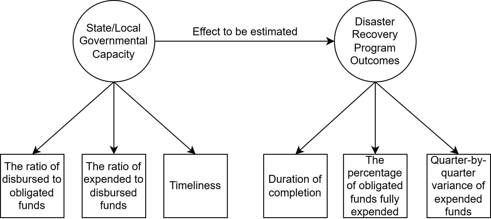

# Introduction

The effective administration of disaster recovery funds from the U.S. Department of Housing and Urban Development (HUD) across affected jurisdictions is central to advancing equitable and timely community recovery. In the United States, the Community Development Block Grant-Disaster Recovery (CDBG-DR) program has become one of the largest and most flexible sources of long-term recovery assistance following major disaster declarations (Costa et al., 2026). Yet despite its national importance, the pace at which grantees---states, counties, cities, and territories---obligate, disburse, and expend CDBG-DR funds varies markedly across jurisdictions and disaster events. Slow or inconsistent financial performance has been repeatedly linked to delayed housing reconstruction, prolonged displacement, uneven economic recovery, and persistent inequities for low-income households and historically marginalized communities (Rouhanizadeh et al., 2020; Rouhanizadeh et al., 2022).

A key factor influencing financial performance and program outcomes is the administrative throughput of grantees---their institutional ability to move funds efficiently through the federal pipeline (Miao et al., 2025). However, throughput in disaster recovery is inherently difficult to measure directly. Prior studies have often relied on single-period financial indicators (Cevik & Huang, 2018; Dzigbede et al., 2020; Lindsay, 2014) or case-based assessments (Hamideh, 2015; Rosas et al., 2021), which limit the ability to compare throughput across time, jurisdictions, and disaster contexts. The Quarterly Performance Reports (QPRs) submitted through HUD's Disaster Recovery Grant Reporting (DRGR) system provide a valuable opportunity to develop comprehensive and comparable indicators. These reports consistently record quarterly obligated, disbursed, and expended amounts for each grantee and activity, generating rich panel data that enable systematic evaluation of financial performance and program timeliness. Nevertheless, raw financial measures alone cannot fully capture the multidimensional nature of administrative throughput in disaster recovery, which reflects the combined effects of administrative resources, workload manageability, and recovery outcomes (Kusumasari et al., 2010).

Therefore, we address the following research questions:

1. How can state and local administrative throughput for CDBG-DR funds be conceptualized, operationalized, and empirically measured?
2. How is variation in throughput associated with disaster recovery program outcomes, and which institutional, socioeconomic, and programmatic conditions covary with recovery performance and timeliness?
3. How do secondary descriptive spatial summaries illustrate where workload manageability, recovery timeliness, and contextual vulnerability coincide across counties and state-administered recovery systems?

To address these questions, we develop a cross-sectional Structural Equation Modeling (SEM) framework to conceptualize, measure, and compare administrative throughput in CDBG-DR fund management and disaster recovery program implementation. Using administering-jurisdiction profiles constructed from quarterly QPR records and linked contextual covariates, the SEM is used as an exploratory latent-summary framework rather than as proof that every indicator is a fully validated reflective manifestation of a single underlying trait. The design does not estimate causal effects or formal moderation. Instead, state-versus-local status, jurisdiction size, and social vulnerability enter the SEM as observed covariates, while the spatial sections provide descriptive context for the core measurement and structural results.

The analysis makes three contributions. First, it operationalizes throughput in CDBG-DR administration using both resource indicators and workload-manageability indicators rather than a single ratio. Second, it compares a one-factor and a two-factor SEM so that the measurement tradeoffs are visible instead of being hidden behind a single preferred specification. Third, it treats the SEM as the core evidence and uses spatial summaries only as supplementary descriptive illustrations.

# Literature Review

## Institutional Context of CDBG-DR Administration and Implementation Performance

CDBG-DR funding has expanded substantially over the past two decades, allocating billions of dollars in response to major hurricanes, floods, wildfires, and other disasters (Costa et al., 2026). As a block-grant program, CDBG-DR provides grantees with considerable flexibility in designing and implementing recovery programs. However, this flexibility also introduces significant administrative burden, particularly in ensuring that funds are obligated, disbursed, and expended efficiently and in compliance with federal requirements. Numerous evaluations have documented persistent delays in grant implementation, including challenges related to procurement processes, environmental reviews, and program start-up activities (Costa et al., 2026; Martin, 2018; Miao et al., 2025; U.S. Department of Housing and Urban Development, 2026). Additionally, grantees vary substantially in their prior experience with disaster recovery programs, staffing levels, and administrative procedures---factors that can significantly influence the timeliness and effectiveness of fund deployment and program implementation (Martin et al., 2022; Melendez, 2020; Van Niekerk et al., 2018).

Despite the growing scale and importance of CDBG-DR funding, relatively limited research has systematically measured grantees' administrative throughput or examined its role in shaping fund administration and program implementation. One major challenge is the historical lack of comprehensive, structured datasets that enable consistent analysis of CDBG-DR fund deployment. Although HUD requires quarterly reporting through the DRGR system via QPRs---which document obligated, disbursed, and expended amounts by grantee, activity, and reporting period---these data have not yet been widely leveraged by auditors, HUD practitioners, or researchers to model the latent dimensions or underlying determinants of throughput. Instead, prior studies have generally relied on descriptive summaries or aggregate comparisons to evaluate financial performance (Costa et al., 2026; Martin, 2018). This limitation constrains a more comprehensive understanding of how throughput influences fund utilization and, ultimately, the effectiveness and performance of disaster recovery efforts.

## Methodological Approaches for Disaster Recovery Administration Assessments

Four broad approaches have been used to evaluate fund administration performance in disaster recovery. The first consists of descriptive and programmatic assessments. HUD and the Government Accountability Office, for example, document variation in fund utilization rates and administrative monitoring across grantees (U.S. Government Accountability Office, 2019; U.S. Department of Housing and Urban Development, 2026). While these studies reveal substantial variation in performance, they generally do not examine the institutional mechanisms that drive differences in disaster recovery outcomes. The second approach involves regression-based and panel-data analyses. Many studies in public administration and planning apply regression or longitudinal panel models to examine how staffing levels, administrative experience, governance structure, or disaster severity influence the pace of fund implementation, recovery outcomes, and broader disaster resilience (Cutter et al., 2016; Lee, 2019; Nor, 2025). These approaches provide useful empirical insight, but they typically treat financial indicators as directly observed outcomes and do not model throughput as a latent construct reflected through multiple interrelated indicators.

The third approach consists of case studies and qualitative evaluations. Qualitative research provides an in-depth understanding of administrative processes and identifies recurring implementation barriers, including procurement requirements, environmental review procedures, and coordination challenges across agencies (Jordan et al., 2014; Ospina et al., 2018; Rouhanizadeh et al., 2020). The fourth approach involves latent-variable methods, particularly SEM. In the broader disaster research literature, SEM has been used to study multidimensional concepts such as preparedness, perceived risk, institutional resilience, and adaptive capacity (Geddam et al., 2024; Gendeshmin et al., 2025). Applications of SEM to federal disaster-recovery finance remain limited, however, and few studies have used QPR data to construct latent measures of throughput for CDBG-DR administration.

## Administrative Throughput in Disaster Recovery: Patterns, Gaps, and Research Needs

Building on the four approaches discussed above, two consistent patterns emerge. First, there is substantial variation across grantees in how disaster recovery funds are administered (Costa et al., 2026). Grantees differ widely in their pace of obligations, disbursements, and expenditures, as well as in the implementation and outcomes of disaster recovery programs (Martin, 2018). Second, administrative processes strongly influence recovery timelines (Martin et al., 2019; Safapour et al., 2021). Delays often arise from procurement rules, environmental reviews, inconsistent staffing, and challenges in inter-agency coordination. Moreover, institutional capacity and social vulnerability---not merely disaster severity---play a critical role in shaping the speed and effectiveness of recovery efforts (Miao et al., 2025; Peacock et al., 2014).

Despite progress in understanding disaster recovery administration, several gaps remain. First, few studies develop multidimensional measures of throughput that combine staffing, payroll, and workload-density indicators into one transparent framework. Second, cross-jurisdictional comparisons rarely distinguish resource intensity from workload manageability, even though those dimensions may behave differently. Third, the relationship between throughput and recovery outcomes is often examined without enough attention to maturity, right-censoring, and cross-cohort comparability. Fourth, spatial summaries are frequently presented without a clear statement of whether they are core evidence or descriptive context. These gaps motivate a more explicit and bounded SEM design.

In response, we develop a cross-sectional SEM of administering-jurisdiction throughput and recovery outcomes using linked QPR, QCEW, population, and SVI indicators. We focus on the distinction between Administrative Resources and workload manageability and evaluate how those dimensions covary with Recovery Timeliness, while treating Recovery Performance as a broader and less settled secondary construct. The accompanying spatial summaries and gap screens serve only as secondary descriptive context.

# Data

## Data Description and Sources

The QPR dataset was obtained from the U.S. Department of Housing and Urban Development's DRGR reporting system and contains quarterly information on obligated, disbursed, and expended CDBG-DR funds for grants and reporting activities. The records span 18 disaster contexts from 2003 through 2023 and include thousands of organization labels that appear in grantee and activity fields (U.S. Department of Housing and Urban Development, 2026). Quarterly records were used to construct study-window outcome indicators for each administering jurisdiction, including the disbursed-to-obligated ratio, the expended-to-disbursed ratio, the share of obligated funds fully expended, the proportion of programs completed, the duration of grant completion, and the average duration of program completion. Throughout the manuscript, *grantee* refers to HUD's DRGR administrative label, *activity responsible organization* refers to the raw quarterly reporting name, and *administering jurisdiction* refers to the analytic SEM unit after those reporting entities are linked to a common state-agency or county-linked local-government profile. *Grant* denotes the disaster-specific CDBG-DR allocation, whereas *activity* denotes the underlying DRGR/QPR reporting unit nested within a grantee's disaster portfolio. The quarter-varying spending indicators therefore summarize the observed reporting history of each administering jurisdiction rather than a single quarter snapshot.

Administrative resource data were drawn from the U.S. Bureau of Labor Statistics Quarterly Census of Employment and Wages (QCEW). Employment and payroll measures tied to NAICS 925110 (Administration of Housing Programs) are used as indirect proxies for disaster-recovery administrative resources (U.S. Bureau of Labor Statistics, 2026). These measures provide a standardized national frame, but they should not be interpreted as direct counts of staff assigned specifically to CDBG-DR. Disaster recovery administration may be distributed across agencies, temporary teams, contract support, and cross-departmental arrangements that are only partially captured by this industry code. Accordingly, employment and payroll are used as coarse administrative-resource indicators rather than exact staffing measures.

Finally, contextual measures of social vulnerability were derived from the CDC/ATSDR Social Vulnerability Index (SVI) at the state and county levels. The analysis uses the four standard SVI themes---socioeconomic status, household composition and disability, minority status and language, and housing type and transportation---as broad contextual covariates rather than as precise longitudinal trend measures (CDC/ATSDR, 2026). Because CDC warns against literal cross-vintage comparison of SVI percentiles without careful harmonization, these variables are interpreted as standardized contextual descriptors in the final SEM-ready dataset rather than as year-by-year measures of change.

## Data Cleaning and Preprocessing

To prepare the QPR dataset for modeling, a series of systematic data cleaning procedures were implemented to standardize key geographic and organizational variables and enhance data reliability. First, the "Grantee State" variable was standardized to ensure consistent formatting across observations. Second, the "Activity Responsible Org" field was normalized to reduce inconsistencies in organization names---this included trimming whitespace, removing special characters, and standardizing common abbreviations. Third, a new geographic identifier was constructed to determine the county and state associated with each Activity Responsible Org. The matching workflow followed a hierarchical approach: explicit county or parish names embedded in organization titles were matched first, and remaining records were linked through city-to-county lookup tables (Gigasheet, 2026) and manual review of unresolved cases. City-level entities were aggregated to counties, while statewide departments, agencies, authorities, and similar organizations were aggregated to state-agency profiles. This procedure provided a workable geography layer for descriptive mapping, but it should not be treated as a fully audited Census relationship-file reconstruction. Geography-dependent findings are therefore interpreted as informative spatial summaries rather than as exact administrative-boundary measures.

Finally, a quality-control framework was implemented to evaluate the reliability of the inferred geographic information. Each record was categorized by match type (for example, explicit county match, city-to-county match, or unresolved) and flagged for manual review when automated inference was uncertain. Records with fewer than four quarterly observations were excluded from the cross-sectional SEM input because such short reporting histories do not provide enough information to summarize recovery performance or timeliness reliably. Appendix Table A1 reports the recoverable data flow: 130,605 standardized QPR rows, 128,382 rows with valid quarter labels, 3,623 collapsed grantee-disaster-quarter records, and finally 573 administering-jurisdiction profiles---30 state agencies and 543 local governments---for the complete-case SEM sample. The SEM therefore estimates between-jurisdiction differences in accumulated administrative profiles, not within-jurisdiction change over time. Appendix Section A.6 reports the geography matching audit showing that all state-agency and county-linked SEM labels resolve to official Census GEOIDs.

# Methods: Structural Equation Modeling

## Model Selection and Unit of Analysis

We employ structural equation modeling (SEM) to develop latent constructs representing administrative throughput and disaster recovery outcomes and to evaluate the cross-sectional associations among them. The design does not estimate moderation effects. Instead, the state-versus-local indicator, jurisdiction size, and social vulnerability measures enter the SEM as observed covariates, and any state/local contrasts discussed later are treated as descriptive subset comparisons rather than as formal interaction tests. SEM remains useful in this setting as a structured way to summarize multiple indicators measured on different scales, but the pooled measurement model should be read as an exploratory approximation rather than as a demonstrated invariance result across state and local cases. Measurement equivalence across institutional types (state agencies vs. local governments) has not been formally tested, and the institutional heterogeneity between these types---centralized disaster-recovery offices versus general-purpose community development departments---means that identical throughput ratios may reflect different administrative realities. Clustered standard errors, which would account for within-type correlation, would likely widen confidence intervals beyond those reported here.

This approach is especially valuable because administrative throughput is not directly observable and must instead be inferred from measurable proxies, such as administrative resources and workload characteristics (El-Taliawi & Van Der Wal, 2019). By integrating measurement and structural components into a single analytical framework, SEM provides a rigorous method for evaluating both the validity of latent constructs and the strength of their relationships with disaster recovery performance outcomes.

The analysis uses a cross-sectional dataset of 573 administering-jurisdiction profiles, including 30 state agencies and 543 local jurisdictions. For state cases, the observation is the state agency that administers one or more CDBG-DR grants. For local cases, the observation is a county-linked local-government profile formed by aggregating city entities and activity organizations to a common administering jurisdiction. Each observation therefore summarizes an administering jurisdiction's resource and recovery profile across the study window rather than representing a single quarter or a single disaster episode. This aggregation permits a national SEM, but it is also a strong modeling assumption because it compresses variation across disaster cohorts, federal policy periods, staffing arrangements, and portfolio complexity into one cross-sectional profile.

## Conceptualization of Administrative Throughput

We conceptualize administrative throughput as the institutional ability of public agencies to administer CDBG-DR funds under differing levels of workload and contextual constraint (Khalid & Ashraf, 2024). The two-factor specification separates Administrative Resources from workload manageability, which is labeled Administrative Burden Capacity in the SEM output. Administrative Resources are represented by staffing and payroll intensity proxies derived from QCEW-based employment and payroll measures, while Workload Manageability (labeled Administrative Burden Capacity in the SEM output) is represented by staff-scaled workload indicators that relate the number of disaster programs and disaster events to available staffing. This two-part conceptualization is used as an exploratory latent summary of administrative infrastructure and workload pressure rather than as definitive proof that the indicators are interchangeable reflective manifestations of a single throughput trait.

A specification tension is worth noting explicitly: the indicators may be better understood as formative components that jointly constitute throughput rather than as reflective manifestations of a single latent trait. In a reflective specification, each indicator is caused by an underlying administrative dimension; in a formative specification, the indicators are determinants of a composite. The models reported here adopt a reflective specification for estimation convenience, but this choice is not validated. The factor loadings should therefore be read as exploratory summaries of covariation, not as evidence that a single latent trait generates the observed indicators.

Two additional indicators reflect administrative workload intensity relative to staffing levels: the number of disaster recovery programs per staff (programs_per_staff) and the number of disaster events per staff (disasters_per_staff). Higher workload per staff implies greater administrative strain, not greater throughput. To keep coefficient signs interpretable, both workload measures are reverse-coded so that higher values on the SEM input correspond to lower relative burden and, therefore, more favorable workload conditions. Operationally:

$$\text{avg\_employment} = \frac{\text{total\_employments}}{\text{total\_population}}$$

$$\text{avg\_payroll} = \frac{\text{quarter\_total\_payroll}}{\text{total\_population}}$$

$$\text{programs\_per\_staff} = \frac{\text{Num\_Program}}{\text{total\_employments}}$$

$$\text{disasters\_per\_staff} = \frac{\text{Num\_Disaster}}{\text{total\_employments}}$$

$$\text{rev\_programs\_per\_staff} = -\text{programs\_per\_staff}$$

$$\text{rev\_disasters\_per\_staff} = -\text{disasters\_per\_staff}$$

## Conceptualization of Disaster Recovery Outcomes

Disaster recovery outcomes are modeled as two latent constructs: Recovery Performance and Recovery Timeliness. Recovery Performance captures the effectiveness of financial management and program implementation and is measured using four indicators: the disbursed-to-obligated ratio, the expended-to-disbursed ratio, the share of obligated funds fully expended, and the proportion of programs completed. Together, these measures summarize how effectively jurisdictions move funds through the recovery pipeline and convert those funds into completed programs. These are cumulative administrative summary measures, not event-history outcomes. Because DRGR portfolios are updated through corrections, reimbursements, and accounting adjustments, some observed cumulative ratios can exceed 1.0 in the raw administrative file, especially for expended-to-disbursed and fully-expended measures. The main SEM retains those observed values rather than mechanically truncating them. Appendix Table C7 reports how often ratios exceed 1.0 and shows a capped-ratio sensitivity check so that this accounting feature is explicit rather than hidden.

Recovery Timeliness represents the speed and consistency of program and grant implementation. It is measured using the duration of grant completion and the average duration of program completion, both reverse-coded so that higher values indicate faster implementation. These are useful summary indicators, but they are also sensitive to maturity and right-censoring. Newer grants and ongoing portfolios have had less time to close out, so timeliness is treated as a cross-sectional summary of observed completion pace rather than as a fully uncensored event-history outcome. Because longer completion durations indicate slower implementation, both duration variables are reverse-coded prior to model estimation:

$$\text{rev\_duration\_of\_grant\_completion} = -\text{duration\_of\_grant\_completion}$$

$$\text{rev\_average\_duration\_program\_completion} = -\text{average\_duration\_program\_completion}$$

## Control Variables

To account for contextual differences across jurisdictions, the SEM includes governmental level, jurisdiction size, and social vulnerability covariates (Peacock et al., 2014; CDC/ATSDR, 2026). Governmental level is represented by a binary indicator coded 1 for state agencies and 0 for local governments. This variable is modeled as a direct predictor and later used to organize descriptive subset comparisons; it is not a moderation term. Jurisdiction size is captured through total population, and the four SVI themes are included as broad contextual controls. Because the final SEM-ready dataset stores these covariates in standardized form, coefficients reflect cross-sectional associations within the aggregated administering-jurisdiction sample rather than temporal effects of changing population or SVI conditions. State and local cases are therefore adjusted within a pooled model, but they are not treated as institutionally interchangeable units for strong comparative inference.

## SEM Modeling Framework

The primary SEM specification decomposes administrative throughput into two related latent dimensions---Administrative Resources and Administrative Burden Capacity---while representing disaster recovery outcomes as two related latent constructs---Recovery Performance and Recovery Timeliness. This specification is used as the main interpretive model because it better separates resource levels from workload pressure and produces stronger conventional fit indices than the one-factor alternative, even though the alternative retains lower AIC and BIC. The two-factor SEM is therefore used as the primary summary model, while the underlying measurement logic remains explicitly exploratory.

{#fig-sem-conceptual}

The SEM framework enables the analysis to distinguish between the effects of greater administrative resources and those associated with lower relative workload burdens. Both latent throughput dimensions are specified as predictors of Recovery Performance and Recovery Timeliness while controlling for governmental level, jurisdiction size, and the four SVI dimensions. The two throughput dimensions are allowed to covary, as are the two outcome constructs. These are modeled as direct relationships rather than as interaction or moderation effects.

The measurement model defines the relationships between latent constructs and their observed indicators:

- AdminResources $\leftarrow$ avg_employment, avg_payroll
- AdminBurdenCapacity $\leftarrow$ rev_programs_per_staff, rev_disasters_per_staff
- RecoveryPerformance $\leftarrow$ ratio_disbursed_to_obligated, ratio_expended_to_disbursed, ratio_total_obligated_funds_fully_expended, ratio_program_completed
- RecoveryTimeliness $\leftarrow$ rev_duration_of_grant_completion, rev_average_duration_program_completion

The structural model specifies the relationships between throughput, control variables, and the latent outcome constructs:

- RecoveryPerformance $\sim$ AdminResources + AdminBurdenCapacity + state_or_local + total_population + SVI controls
- RecoveryTimeliness $\sim$ AdminResources + AdminBurdenCapacity + state_or_local + total_population + SVI controls

The working expectation is that jurisdictions with greater administrative resources and lower relative workload pressure will exhibit stronger recovery outcomes. This expectation is treated as a cross-sectional associational hypothesis rather than as a claim of causal identification.

## Experimental Design and Model Estimation

Two model-comparison and sensitivity strategies were implemented. First, the analysis compares a two-factor SEM, in which Administrative Resources and Administrative Burden Capacity are estimated separately, with a one-factor SEM that combines all four indicators into a single factor. Second, a series of robustness checks vary the specification (dropping weak indicators, residualizing burden indicators), add controls (maturity bands, portfolio scale), restrict the sample (cohort-restricted and stratified models), and test alternative burden indicators (raw portfolio counts instead of staffing-denominator ratios). These sensitivity analyses are reported in Appendix C.

In the alternative one-factor SEM framework, the measurement model for a single throughput factor (GovCapacity) is defined using all four observed indicators: avg_employment, avg_payroll, rev_programs_per_staff, and rev_disasters_per_staff, while the measurement models for the disaster recovery outcome constructs remain unchanged. The structural relationships are:

- RecoveryPerformance $\sim$ GovCapacity + state_or_local + total_population + SVI controls
- RecoveryTimeliness $\sim$ GovCapacity + state_or_local + total_population + SVI controls

Prior to SEM estimation, all continuous indicators were standardized as z-scores to improve comparability across variables and to support model convergence, while the state_level indicator remained coded 0/1. The complete-case SEM input contains 573 jurisdictions and 17 variables with no remaining missing values. The SEMs were estimated with conventional maximum likelihood estimation (Lee & Zhu, 2002), so the fit statistics, standard errors, confidence intervals, and p-values reported here are conventional ML quantities. Model evaluation relies on a combination of fit statistics---chi-square, CFI, TLI, RMSEA, AIC, and BIC---rather than on a single threshold. Model comparison is therefore treated as a tradeoff exercise: the two-factor model is substantively more informative and fits better on the main incremental and absolute fit measures, while the one-factor model remains more parsimonious by information criteria. Appendix Table B5 verifies the reported fit statistics against reruns on the 573-jurisdiction SEM-ready dataset.

# Results

## SEM Model Comparison

Both SEM specifications were estimated to examine the relationship between administrative throughput and disaster recovery outcomes: (1) a one-factor model in which all four throughput indicators load on a single factor and (2) a two-factor model that separates Administrative Resources from Administrative Burden Capacity. @tbl-model-comparison reports the comparison for the 573-jurisdiction complete-case SEM sample.

| Metric | One-Factor | Two-Factor |
|--------|----------:|----------:|
| Chi-square (df) | 741.72 (101) | 469.82 (98) |
| Chi-square p-value | < 0.001 | < 0.001 |
| CFI | 0.854 | 0.915 |
| TLI | 0.818 | 0.891 |
| RMSEA | 0.105 | 0.081 |
| AIC | 67.41 | 74.36 |
| BIC | 219.69 | 239.69 |

: SEM model fit comparison (N = 573). AIC and BIC are reported for both models. The one-factor model has lower information criteria despite worse incremental fit, reflecting the parsimony penalty on the two-factor model's additional parameters. {#tbl-model-comparison}

The model comparison reveals a genuine tradeoff rather than an unambiguous winner. The one-factor model has lower information criteria (AIC = 67.41; BIC = 219.69), but the two-factor model fits the covariance structure more convincingly on the conventional SEM diagnostics (CFI = 0.915 versus 0.854; TLI = 0.891 versus 0.818; RMSEA = 0.081 versus 0.105). Because the two-factor model aligns more closely with the distinction between resources and workload as separate dimensions of administrative throughput, and because it improves the main fit indices materially, it is used as the primary substantive model. At the same time, the one-factor alternative is more parsimonious by AIC/BIC, so the two-factor model should be interpreted as preferred conditionally rather than as definitively superior on every criterion. Appendix Table B5 reports the fit-verification comparison.

The measurement parameters of the two-factor model also motivate a cautious but interpretable reading. Within Administrative Resources, standardized loadings are strong for employment (0.953) and payroll (0.992). Within Administrative Burden Capacity, the reverse-coded programs-per-staff indicator loads at 0.577 and disasters-per-staff loads at approximately 1.000, indicating that the second factor is driven more heavily by the disaster-workload component. Recovery Performance is less coherent: disbursed-to-obligated loads at 0.785, obligated funds fully expended at 0.988, programs completed at 0.477, and expended-to-disbursed at $-$0.131. Recovery Timeliness is identified by reverse-coded duration of completion (0.545) and reverse-coded average program duration (1.000). The two latent throughput dimensions are positively correlated (standardized covariance = 0.402), and the structural part of the model explains more variance in Recovery Timeliness than in Recovery Performance (approximate latent $R^2$ = 0.20 versus 0.09, based on standardized residual variances). These features argue for interpreting the model as an exploratory cross-sectional measurement structure rather than as a final, fully settled confirmatory SEM. Recovery Timeliness is the more coherent and policy-relevant outcome, whereas Recovery Performance is better treated as a broader secondary summary. Appendix Tables B1--B3 report the full measurement, structural, and covariance parameters. Appendix Tables C1--C7 report the sensitivity, proxy-validation, maturity, cohort-restricted, stratified, and ratio-artifact diagnostics.

## Structural Relationships Between Throughput and Recovery Outcomes

The structural results indicate that Administrative Resources and Administrative Burden Capacity relate to different recovery outcomes in different ways. @tbl-structural reports a highlighted subset of the standardized structural path coefficients from the two-factor SEM together with unstandardized 95% confidence intervals. Appendix Table B2 reports the full modeled path set, factor covariances, and residual terms.

| Path | Std. Beta | Unstd. b | 95% CI | p-value |
|------|----------:|---------:|-------:|--------:|
| AdminResources $\to$ RecoveryPerformance | $-$0.170 | $-$0.139 | [$-$0.212, $-$0.066] | < 0.001 |
| AdminBurdenCapacity $\to$ RecoveryPerformance | 0.077 | 0.104 | [$-$0.015, 0.222] | 0.086 |
| AdminResources $\to$ RecoveryTimeliness | 0.080 | 0.046 | [$-$0.004, 0.095] | 0.072 |
| AdminBurdenCapacity $\to$ RecoveryTimeliness | 0.266 | 0.251 | [0.151, 0.352] | < 0.001 |
| SVI Theme 3 (Minority/Language) $\to$ RecoveryPerformance | $-$0.226 | -- | -- | < 0.001 |
| SVI Theme 1 (Socioeconomic) $\to$ RecoveryTimeliness | $-$0.194 | -- | -- | 0.004 |
| SVI Theme 2 (HH Comp./Disability) $\to$ RecoveryTimeliness | $-$0.159 | -- | -- | 0.004 |
| State-vs-Local $\to$ RecoveryPerformance | $-$0.038 | $-$0.133 | [$-$0.526, 0.259] | 0.505 |
| State-vs-Local $\to$ RecoveryTimeliness | $-$0.106 | $-$0.260 | [$-$0.520, 0.000] | 0.050 |

: Structural path estimates in the two-factor SEM {#tbl-structural}

*Note*: Appendix Table B2 reports the complete modeled coefficient set.

### Relationships with Recovery Performance

Administrative Resources exhibit a negative association with Recovery Performance ($\beta$ = $-$0.170; $b$ = $-$0.139, 95% CI [$-$0.212, $-$0.066]; p < 0.001), indicating that jurisdictions with higher staffing and payroll intensity do not necessarily display stronger financial execution or program completion once workload pressure and contextual conditions are taken into account. This coefficient should not be read as evidence that more resources worsen recovery; at most it suggests that resource intensity may proxy for more complex portfolios or administrative settings that the pooled cross-sectional model does not fully observe. By contrast, Administrative Burden Capacity is positive but only marginally associated with Recovery Performance ($\beta$ = 0.077; $b$ = 0.104, 95% CI [$-$0.015, 0.222]; p = 0.086). Manageable workload appears helpful for performance, but the evidence is much stronger for timeliness.

Among the covariates, SVI Theme 3 (minority status and language vulnerability) shows the clearest association with Recovery Performance ($\beta$ = $-$0.226, p < 0.001). This pattern should be read as contextual rather than causal: jurisdictions serving more linguistically diverse or historically marginalized communities may face greater outreach, translation, verification, and service-delivery demands, not because those communities cause weaker recovery, but because administrative barriers and structural inequities can be harder to overcome in those settings.

### Relationships with Recovery Timeliness

For Recovery Timeliness, Administrative Burden Capacity plays the clearest role. Lower workload pressure relative to available staffing is strongly associated with faster and more consistent recovery implementation ($\beta$ = 0.266; $b$ = 0.251, 95% CI [0.151, 0.352]; p < 0.001), indicating that administrative strain is an important constraint on implementation speed. Administrative Resources are positively associated with Recovery Timeliness as well, but only marginally ($\beta$ = 0.080; $b$ = 0.046, 95% CI [$-$0.004, 0.095]; p = 0.072). This contrast reinforces the main substantive message: resource levels matter, but workload manageability appears to be the more consistent cross-sectional correlate of timely recovery administration.

Two dimensions of social vulnerability are also significantly associated with Recovery Timeliness. Higher values of SVI Theme 1 (socioeconomic vulnerability) and SVI Theme 2 (household composition and disability) are associated with slower implementation ($\beta$ = $-$0.194, p = 0.004; $\beta$ = $-$0.159, p = 0.004). The results suggest that jurisdictions serving more socioeconomically vulnerable and demographically constrained populations may face additional administrative frictions that slow recovery even after throughput proxies are taken into account.

The state-versus-local indicator is not statistically meaningful for Recovery Performance ($\beta$ = $-$0.038; p = 0.505) and is only borderline negative for Recovery Timeliness ($\beta$ = $-$0.106; p = 0.050). Governmental level is therefore treated as a control variable and a descriptive comparison device, not as a moderator of throughput effects. The negative sign for timeliness suggests that local governments may, on average, move somewhat faster than state agencies once other covariates are controlled, but the evidence is too modest and the institutional tasks too heterogeneous to support strong claims about institutional superiority.

### SEM-Implied Relationship Patterns

The SEM-implied predicted relationship plots further indicate that Administrative Burden Capacity explains more of the visible variation in recovery outcomes than Administrative Resources alone. The relationship between workload manageability and both Recovery Performance and Recovery Timeliness is upward, with the pattern appearing substantially stronger for timeliness. These plots are useful visualization tools, but they should not be interpreted as evidence of nonlinear causal effects; they are derived from the fitted SEM and are best read as model-implied association curves.

Administrative Resources exhibit a more complex relationship with recovery outcomes. The negative coefficient for Recovery Performance may reflect the fact that larger staffing and payroll footprints are characteristic of more complex or higher-demand recovery portfolios. Once workload is modeled explicitly, the resource indicators no longer behave like simple monotonic measures of administrative effectiveness.

Most state agencies and local governments maintained relatively limited staffing resources dedicated to administering CDBG-DR housing recovery programs. As a result, the standardized values of both Administrative Resources and Administrative Burden Capacity were concentrated near zero for many jurisdictions, leading to more modest and sometimes less stable marginal effects across recovery outcomes. This suggests that improving recovery outcomes requires not only reducing administrative workload pressures but also strengthening staffing and fiscal resources. However, increasing administrative resources alone is insufficient to ensure effective recovery implementation. Rather, enhancing throughput requires a balanced combination of adequate resources and manageable program demands.

## Spatial Patterns of Throughput and Recovery Outcomes

To complement the SEM results, we retain a small descriptive spatial section showing how selected county-level throughput and recovery scores are distributed geographically. These figures are not part of the SEM estimation and are not used to establish additional statistical claims. Instead, they provide visual context for whether the burden-throughput pattern identified in the SEM appears concentrated in particular regions.

Across the retained maps, the main descriptive pattern is straightforward: workload manageability and Recovery Timeliness appear more closely aligned than raw Administrative Resources and Recovery Performance. Because these maps inherit values from county-linked and state-agency profiles, they are best interpreted as secondary descriptive context. The quadrant overlays and related county-level summaries are retained as supplementary illustrations whose main value is to show that the stronger burden-timeliness relationship is not purely abstract when mapped descriptively. The gap diagnostics, governance-risk screen, and exposure-capacity typologies are available in the appendix for practitioners who may wish to use them as informal screening tools.

# Discussion

## Rethinking Throughput: A Multi-Dimensional and Relational Perspective

The results advance a more differentiated understanding of administrative throughput in disaster recovery by showing that throughput is not well captured by a single resource proxy. Across the SEM and the limited descriptive spatial overlays, the most consistent pattern is that recovery outcomes are more closely aligned with workload manageability than with staffing and payroll intensity alone. That does not mean resources are irrelevant; rather, it suggests that resources must be interpreted relative to the disaster and program burdens they are expected to absorb.

Consistent with Annan-Prah and Andoh (2023), we conceptualize throughput as a joint reflection of resources and performance. However, we further refine this perspective by introducing Administrative Burden Capacity, defined as the effective throughput remaining after accounting for workload pressures and contextual constraints such as social vulnerability. This conceptualization highlights that throughput is inherently relational: administrative resources only translate into effective recovery outcomes when workload demands remain within manageable levels.

A central contribution is the distinction between Administrative Resources and Administrative Burden Capacity. Staffing and payroll reflect the scale of the administrative system, whereas burden capacity reflects how stretched that system is across disasters and programs. The empirical evidence is strongest for Recovery Timeliness, where lower workload pressure is associated with faster implementation. For Recovery Performance, the burden-capacity path is positive but only marginal, which suggests that the performance construct also reflects other dimensions of organizational context, program design, and reporting complexity. Burden capacity appears especially important for timing, and plausibly relevant for performance, but not sufficient by itself to explain all observed differences in recovery execution.

The negative association between Administrative Resources and Recovery Performance further supports this interpretation. Rather than implying that additional staff or payroll harms recovery, the coefficient likely reflects portfolio complexity, organizational layering, or the fact that more administratively intensive jurisdictions often manage more demanding recovery contexts. Once workload is modeled explicitly, pure resource intensity ceases to function as a simple proxy for effectiveness. This result is therefore best treated as a potentially confounded association that cautions against equating larger bureaucratic scale with stronger recovery administration.

## Social Vulnerability and Spatial Inequality in Disaster Recovery

The results also show that different dimensions of social vulnerability relate to recovery outcomes through distinct channels. Minority status and language vulnerability are most clearly associated with weaker Recovery Performance, whereas socioeconomic vulnerability and household composition/disability are more strongly associated with slower Recovery Timeliness. One plausible interpretation is that vulnerability marks contexts in which outreach, verification, coordination, and service delivery barriers are harder to overcome. The SEM does not identify those mechanisms directly, but the differentiated theme coefficients are consistent with the idea that recovery governance becomes more difficult when administrative burden and structural vulnerability overlap.

The limited spatial overlays are retained only as supplementary screening tools. They may help show where workload pressure, exposure, and vulnerability coincide, but they do not establish why those patterns arise.

## Practical Implications

The findings provide decision-makers and practitioners with a more nuanced understanding of throughput by distinguishing resource levels from workload strain. For practice, the key implication is diagnostic: when recovery performance is weak or implementation is slow, the problem may not be simple resource scarcity. It may instead reflect the way staffing, portfolio complexity, disaster exposure, and community vulnerability interact. This perspective can help practitioners diagnose whether recovery challenges stem from insufficient resources, excessive administrative burden, or a broader misalignment between institutional throughput and local recovery needs.

From a policy perspective, the results suggest that improving disaster recovery outcomes requires moving beyond resource-centric approaches toward workload-sensitive and context-aware interventions. Simply increasing funding or staffing may have limited effect if administrative systems remain overextended or if program complexity continues to impose substantial procedural burden. More promising strategies may include simplifying program rules, standardizing reporting and eligibility workflows, deploying temporary surge-capacity teams during high-demand periods (Khorram-Manesh, 2020), improving intergovernmental coordination, and prioritizing high-risk jurisdictions for language access, community outreach, and implementation support. These recommendations remain associationally motivated rather than experimentally verified, but they follow directly from the burden-sensitive interpretation of the results.

Although the real-world effectiveness of these strategies requires additional evaluation, the findings suggest that successful disaster recovery depends not only on the amount of resources available but also on whether those resources are adequate for the complexity, scale, and vulnerability of the recovery environment in which they are deployed.

## Study Limitations

Several limitations should be acknowledged. First, the SEM relies on a cross-sectional administering-jurisdiction dataset, so the results are associational rather than causal. The aggregation from quarterly QPR activity data to one profile per administering jurisdiction discards within-jurisdiction variation across disasters, policy regimes, staffing arrangements, and maturation windows. Appendix Table C3 makes that maturity problem visible by showing that the sample spans markedly different portfolio age bands. Second, the timeliness construct remains duration-based and therefore sensitive to right-censoring and disaster maturity. Newer grants and jurisdictions with ongoing portfolios have had less time to complete recovery activities, which limits how strongly the timeliness factor can be interpreted. The burden-timeliness association reported here should therefore be characterized as pooled-descriptive and maturity-sensitive rather than as a fully robust structural relationship across all cohort compositions. Appendix Table C4 makes this concrete: restricting the sample to mature portfolios (Duration > 48 months) reverses the sign of the burden-timeliness coefficient, indicating that the positive association in the full sample is driven largely by younger, less-complete portfolios. Additionally, Appendix Table C6 shows that replacing the staffing-denominator ratios with raw log-transformed portfolio counts also reverses the sign, suggesting the positive finding is partially a staffing-ratio artifact rather than a pure workload-manageability effect. The pooled results should therefore not be used as a standalone basis for concluding that workload manageability improves timeliness without acknowledging these important qualifications.

Third, the measurement of throughput remains indirect. QCEW NAICS 925110 employment and payroll are useful national proxies but do not directly measure CDBG-DR administrative teams, contractors, or interagency support structures. The workload indicators are likewise simplified workload-density proxies rather than complete measures of administrative strain. Appendix Tables C1, C7, and C2 report the sensitivity checks, ratio-artifact diagnostics, and proxy-validation summaries, but these remain partial validation steps rather than definitive proof that the QCEW measures isolate true CDBG-DR staffing throughput. Similarly, the SVI covariates are used as cross-sectional contextual controls rather than as validated longitudinal trajectories.

Fourth, the geography layer is derived from hierarchical name matching and county aggregation rather than from official Census relationship files alone, even though the SEM sample labels resolve cleanly against official 2023 Census state and county files. Fifth, the gap diagnostics and governance risk index are descriptive composites rather than validated latent constructs.

These limitations point to a clear future research agenda. Longitudinal or event-history designs would address maturity and censoring more directly. More detailed administrative-process data---such as staffing assignments, contractor use, application processing times, and intergovernmental coordination mechanisms---would make it possible to move from proxy throughput measures toward more direct operational indicators of recovery governance. Future work should also test narrower cohorts or panel designs so that age of portfolio and disaster vintage are separated more clearly from administrative throughput.

Despite these limitations, the analysis provides a useful empirical and conceptual contribution. Across the SEM and the descriptive spatial screens, the most consistent message is that disaster recovery governance is shaped not simply by how many resources a jurisdiction has, but by whether those resources are proportionate to disaster workload and to the social conditions of implementation.

# Conclusion

We develop an explicitly exploratory framework for examining administrative throughput and disaster recovery outcomes across the United States. Using pooled cross-sectional administering-jurisdiction profiles, we move beyond purely resource-based indicators and evaluate how staffing proxies, workload pressure, and contextual vulnerability co-occur with Recovery Timeliness and, more tentatively, Recovery Performance. The SEM provides the core evidence, while the gap diagnostics and governance risk index serve as supplementary policy screens.

Several key insights emerge. First, administrative throughput is not well captured as a unidimensional construct. The two-factor model shows that Administrative Resources and Administrative Burden Capacity behave differently and should not be collapsed without checking the measurement tradeoff. Second, the strongest throughput-outcome association in the SEM is between lower workload pressure and faster Recovery Timeliness, whereas the relationship with the broader Recovery Performance construct is weaker and more conditional. Third, social vulnerability matters, but different SVI themes relate to different parts of the recovery process, reinforcing the view that throughput is embedded in broader institutional and community contexts.

The limited descriptive spatial overlays add a geographic dimension to those findings, but only in a supplementary sense. They help orient the reader to where exposure, workload pressure, vulnerability, and weaker outcomes may overlap, while remaining clearly secondary to the SEM.

Taken together, the analysis contributes conceptually by advancing a workload-sensitive view of throughput, methodologically by making the one-factor versus two-factor SEM tradeoff explicit, and practically by showing that workload-sensitive diagnostic screening may be more useful than simple staffing counts alone. The results should therefore be interpreted as exploratory pooled cross-sectional associations, centered on workload manageability and Recovery Timeliness, rather than as definitive causal evidence about CDBG-DR recovery governance.

Improving disaster recovery governance (Tierney, 2012) will require more than funding alone. It will require institutions whose staffing, workload, and social context are better aligned with the scale and complexity of recovery needs. The results provide an empirical starting point for that discussion.

# Acknowledgements {.unnumbered}

This study is partially supported by funding from the U.S. Department of Housing and Urban Development (Award# H21749CA). The findings and conclusions in this manuscript are those of the authors and do not represent the official position or views of the U.S. Department of Housing and Urban Development.

# Disclosure Statement {.unnumbered}

The authors declared no potential conflicts of interest with respect to the research, authorship, and/or publication of this article. Generative AI tools were used only for limited language editing. All analytic decisions, interpretation, and manuscript content were reviewed and approved by the authors.

# Data Availability Statement {.unnumbered}

The public source datasets used in this study are HUD CDBG-DR DRGR/QPR reports, U.S. Bureau of Labor Statistics QCEW files, and CDC/ATSDR SVI data. The replication package for the published manuscript will include the code, SEM-ready analytic data, derived geography linkage files, and nonrestricted outputs needed to reproduce the reported models, tables, and maps. Public source data will be cited directly, and any remaining manually audited linkage notes will be provided as supplemental derived documentation.

# References {.unnumbered}

Annan-Prah, E. C., & Andoh, R. P. K. (2023). Administrative capacity and local level development in metropolitan, municipal and district assemblies in Ghana: mediating role of resource capacity. *International Journal of Public Sector Management, 36*(3), 253--270.

CDC/ATSDR (Centers for Disease Control and Prevention / Agency for Toxic Substances and Disease Registry). (2026). Geospatial Research, Analysis, and Services Program. *CDC/ATSDR Social Vulnerability Index 2022, 2020, 2018, 2016, 2014, 2010, & 2000 Database U.S.* https://www.atsdr.cdc.gov/placeandhealth/svi/data_documentation_download.html

Cevik, M. S., & Huang, G. (2018). *How to manage the fiscal costs of natural disasters*. International Monetary Fund.

Costa, R., Mann, B., Sobhani, A., Hamideh, S., Nejat, A., & Ross, A. (2026). From Allocation to Action: A Comparative Analysis of CDBG-DR Funding Expenditures for 2017 Disasters in California, Florida, and Texas. *SSRN preprint*.

Cutter, S. L., Ash, K. D., & Emrich, C. T. (2016). Urban-rural differences in disaster resilience. *Annals of the American Association of Geographers, 106*(6), 1236--1252.

Dzigbede, K. D., Gehl, S. B., & Willoughby, K. (2020). Disaster resiliency of US local governments: Insights to strengthen local response and recovery from the COVID-19 pandemic. *Public Administration Review, 80*(4), 634--643.

El-Taliawi, O. G., & Van Der Wal, Z. (2019). Developing administrative capacity: An agenda for research and practice. *Policy Design and Practice, 2*(3), 243--257.

Geddam, S. M., Garg, P., & Tyagi, A. (2024). Enhancing disaster management effectiveness: A structural equation modeling approach. *International Journal of Disaster Risk Reduction, 99*, 104123.

Gendeshmin, S. B., Karami, S., & Mousavi, S. M. (2025). Structural equation modeling for disaster risk assessment: A systematic review. *International Journal of Disaster Risk Reduction, 119*, 105301.

Gigasheet. (2026). *List of All U.S. Counties and Cities Spreadsheet* (public lookup table used for preliminary city-to-county matching). https://www.gigasheet.com/sample-data/list-of-all-us-counties-and-cities-spreadsheet

Hamideh, S. (2015). *Planning for disaster recovery: Lessons from Hurricane Ike for theory and practice* (Doctoral dissertation). Texas A&M University.

Jordan, E., Javernick-Will, A., & Amadei, B. (2014). A qualitative comparative analysis of neighborhood recovery following Hurricane Katrina. *International Journal of Disaster Resilience in the Built Environment, 5*(4), 391--412.

Khalid, S., & Ashraf, I. (2024). The Role of Administrative Capacity in Disaster Management. *Social Trends and Policy Review, 2*(2), 97--133.

Khorram-Manesh, A. (2020). Flexible surge capacity---public health, public education, and disaster management. *Health Promotion Perspectives, 10*(3), 175.

Kusumasari, B., Alam, Q., & Siddiqui, K. (2010). Resource capability for local government in managing disaster. *Disaster Prevention and Management, 19*(4), 438--451.

Lee, D. W. (2019). Local government's disaster management capacity and disaster resilience. *Local Government Studies, 45*(6), 803--826.

Lee, S. Y., & Zhu, H. T. (2002). Maximum likelihood estimation of nonlinear structural equation models. *Psychometrika, 67*(2), 189--210.

Lindsay, B. R. (2014). *FEMA's disaster relief fund: overview and selected issues*. Congressional Research Service.

Martin, C. (2018). *The Evidence Base on How CDBG-DR Works for State and Local Stakeholders*. Urban Institute.

Martin, C., Gilbert, B., Teles, D., & Theodos, B. (2019). *Housing Recovery and CDBG-DR*. Urban Institute.

Martin, C., Teles, D., & DuBois, N. (2022). Understanding the pace of HUD's disaster housing recovery efforts. *Housing Policy Debate, 32*(1), 102--127.

Melendez, E. (2020). Puerto Rico Housing and Community Development Industry's Capacity for Disaster Recovery. *Centro Journal, 32*(3).

Miao, Q., Best, K., Reilly, A., & Davlasheridze, M. (2025). Where Did the Money Go? Assessing the Distribution of the Community Development Block Grant-Disasters Recovery Funds. *The American Review of Public Administration, 55*(3), 227--248.

Nor, M. I. (2025). Investigating the dynamics of climate finance disbursements: A panel data approach from 2003 to 2022. *PLOS One, 20*(3), e0318170.

Ospina, S. M., Esteve, M., & Lee, S. (2018). Assessing qualitative studies in public administration research. *Public Administration Review, 78*(4), 593--605.

Peacock, W. G., Van Zandt, S., Zhang, Y., & Highfield, W. E. (2014). Inequities in long-term housing recovery after disasters. *Journal of the American Planning Association, 80*(4), 356--371.

Rosas, E., Roberts, P. S., Lauland, A., Gutierrez, I. A., & Nunez-Neto, B. (2021). Assessing the impact of municipal government capacity on recovery from Hurricane Maria in Puerto Rico. *International Journal of Disaster Risk Reduction, 61*, 102340.

Rouhanizadeh, B., Kermanshachi, S., & Nipa, T. J. (2020). Exploratory analysis of barriers to effective post-disaster recovery. *International Journal of Disaster Risk Reduction, 50*, 101735.

Rouhanizadeh, B., Kermanshachi, S., & Safapour, E. (2022). An investigation of causal relationships among barriers that delay post-hurricane recovery of human communities. *International Journal of Disaster Risk Reduction, 67*, 102666.

Safapour, E., Kermanshachi, S., & Pamidimukkala, A. (2021). Post-disaster recovery in urban and rural communities: Challenges and strategies. *International Journal of Disaster Risk Reduction, 64*, 102535.

Tierney, K. (2012). Disaster governance: Social, political, and economic dimensions. *Annual Review of Environment and Resources, 37*, 341--363.

U.S. Bureau of Labor Statistics. (2026). *Quarterly Census of Employment and Wages*. https://www.bls.gov/cew/downloadable-data-files.htm

U.S. Department of Housing and Urban Development. (2026). *CDBG-DR Reports*. https://www.hud.gov/hud-partners/community-cdbg-dr-reports

U.S. Government Accountability Office. (2019). *Disaster recovery: Better monitoring of block grant funds is needed*. https://www.gao.gov/products/gao-19-232

Van Niekerk, D., Nemakonde, L. D., Kruger, L., & Forbes-Genade, K. (2018). Community-Based Disaster Risk Management. In H. Rodriguez, W. Donner, & J. Trainor (Eds.), *Handbook of Disaster Research*. Springer.

\newpage



\newpage



\newpage


